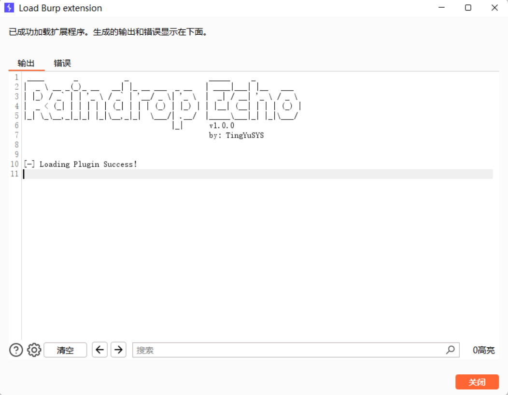
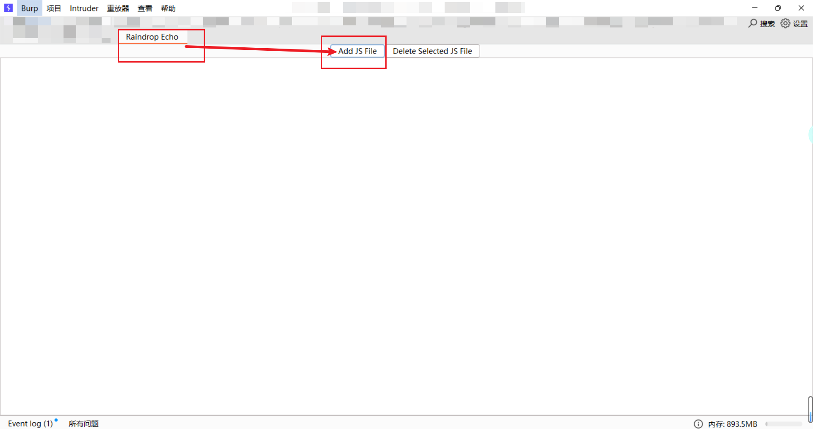
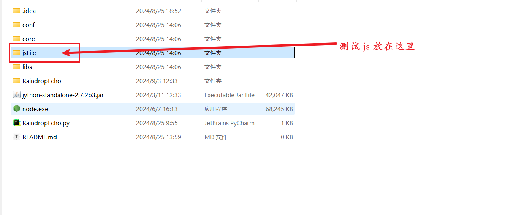
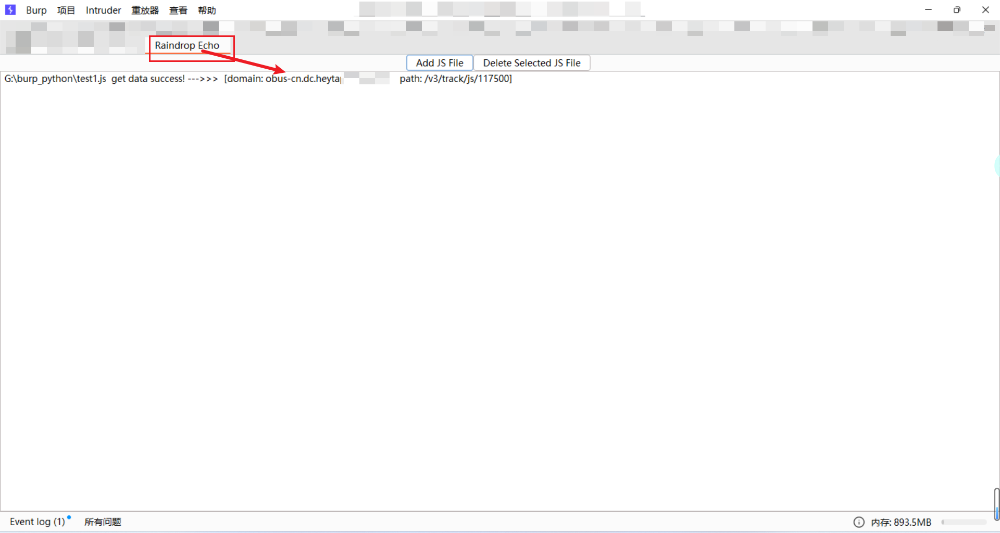
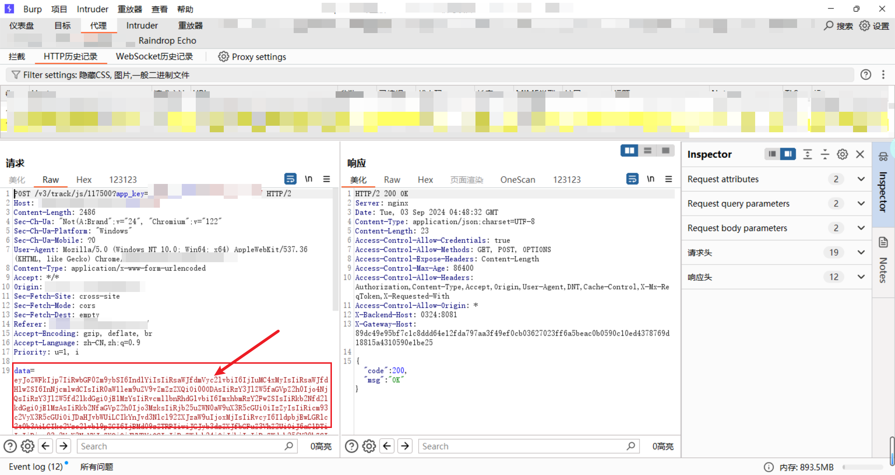
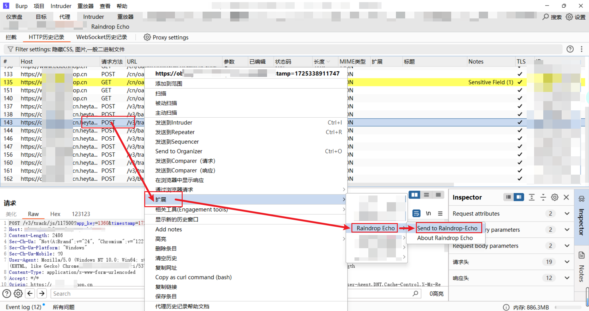
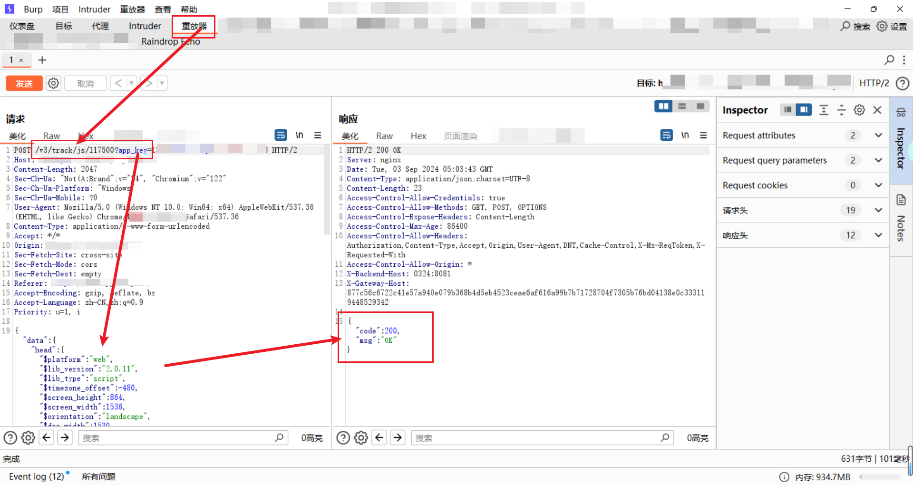

# ✈️ 一、工具概述

日常渗透过程中，经常会碰到一些网站需要破解其 JS 加密算法后，才能对数据包进行修改。我们将加密算法破解出来后，一般就是使用 python 的 requests 库，发送修改的数据包来进行渗透测试，导致效率低下，因此考虑将 JS 逆向的结果通过插件与 burp 结合，提高效率。在 JS 逆向结束之后，通过 RaindropEcho 提供的 JS 模版，导入到插件，就可以完成 burp 数据包的自动加解密。


# 📝 二、TODO

## 功能支持的更新

* [x] 提供 JS 逆向模版，支持自定义编写：指定域名下指定接口的加解密算法
* [x] 支持导入多个模版，同时破解多个接口的加密算法
* [x] 导入模板后，将数据包送到插件里，RaindropEcho 会自动解密，并将解密的数据包放入到重放器
* [x] 修改完数据后，发送数据包，RaindropEcho 会自动拦截明文数据包，进行加密后发出


# 🚨 三、准备工作

- **安装 jython，burp 导入**
- **安装 nodjs，并添加环境变量**


# 🐉 四、工具使用

## JS 逆向模版使用

- 在 encryptFunction 函数里写好加密逻辑
- 在 config 里写好逆向代码对应的域名和接口
- 在 default_json 里写好逆向出来的初始原数据

**JS 逆向模版如下：**

```js
const fs = require('fs');

// 上面自己编写加密函数


// 写加密函数的加载方式
function encryptFunction(data) {
    // 使用 JSON.parse 将字符串转换为 JSON 对象
    const json_data = JSON.parse(data);

    // 原来数据包时什么格式，就要返回什么格式
    return `data=${jeimit(json_data.data)}&crc=${json_data.crc}`
}

// 编写域名和接口
const config = {
    domain: "xxx.com",
    path: "/v3/xxx"
};

// 编写逆向出来的原数据
const default_json = {
  
}

// 下面代码不要动---------------------------------------------------------------

// 检查传递的参数数量
const mode = process.argv[2];

if (mode === 'config') {
    console.log(JSON.stringify(config));
    process.exit(0);
}
if (mode === 'default') {
    console.log(JSON.stringify(default_json));
    process.exit(0);
}

if (process.argv.length < 4) {
    console.error("Usage: node script.js [mode] [inputFile] [outputFile]");
    process.exit(1);
}

const inputFile = process.argv[3];
const outputFile = process.argv[4];

// 读取输入文件内容
let inputData;
try {
    inputData = fs.readFileSync(inputFile, 'utf8');
} catch (err) {
    console.error(`Error reading input file: ${inputFile}`, err);
    process.exit(1);
}

let outputData;

switch (mode) {
    case 'encrypt':
        outputData = encryptFunction(inputData);
        break;

    default:
        console.error(`Unknown mode: ${mode}`);
        process.exit(1);
}

// 将输出数据写入输出文件
try {
    fs.writeFileSync(outputFile, outputData, 'utf8');
} catch (err) {
    console.error(`Error writing to output file: ${outputFile}`, err);
    process.exit(1);
}
```


## 导入插件




## 导入模版文件

**step 1：选择 js 文件**




**step 2：测试 js 文件放置路径（注：js 文件路径一定不要有中文）**




**step 3：导入完成后**




## 插件使用

**注明：**

- **本次演示，选用网站心跳包测试，无任何敏感数据，对网站无任何影响**


**step 1：选择对应的数据包**




**step 2：发送到插件**




**step 3：修改数据包成功发送**




# 🖐 五、免责声明

1. 如果您下载、安装、使用、修改本工具及相关代码，即表明您信任本工具
2. 在使用本工具时造成对您自己或他人任何形式的损失和伤害，我们不承担任何责任
3. 如您在使用本工具的过程中存在任何非法行为，您需自行承担相应后果，我们将不承担任何法律及连带责任
4. 请您务必审慎阅读、充分理解各条款内容，特别是免除或者限制责任的条款，并选择接受或不接受
5. 除非您已阅读并接受本协议所有条款，否则您无权下载、安装或使用本工具
6. 您的下载、安装、使用等行为即视为您已阅读并同意上述协议的约束
